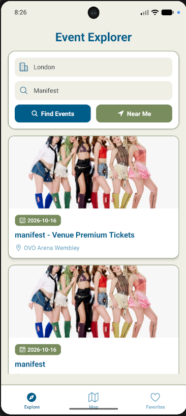
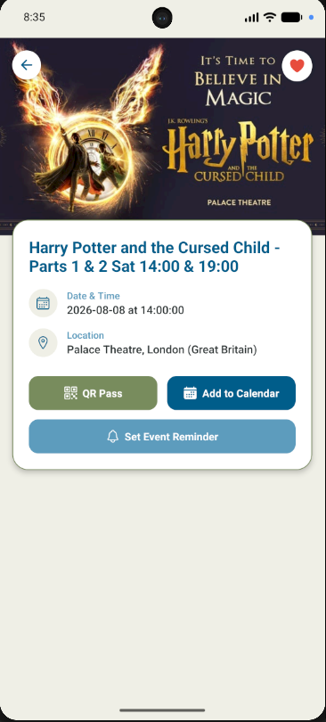
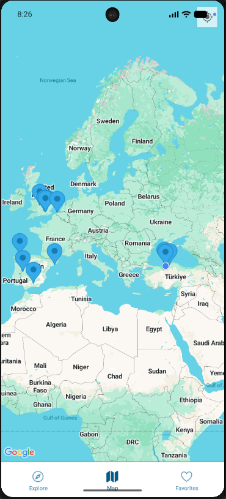
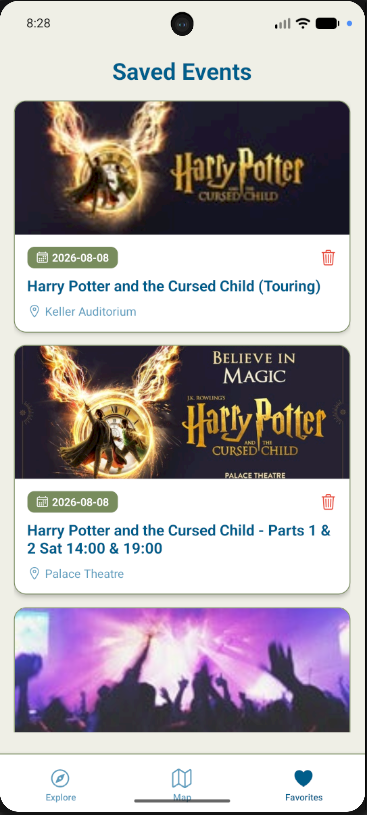

<h2>🎟️ EventExplorer</h2>

EventExplorer, kullanıcıların şehirlerindeki ve yakınlarındaki etkinlikleri keşfetmesini, harita üzerinde görüntülemesini, biletlerine ait dijital QR kodlarını saklamasını ve etkinlik hatırlatıcıları oluşturmasını sağlayan React Native ve Expo tabanlı bir mobil etkinlik keşif uygulamasıdır.

Uygulama canlı verilerini Ticketmaster Discovery API üzerinden almaktadır.

---

<h3>📱 Uygulama Görselleri</h3>

  
  
  
  

---

<h3>📌 Özellikler</h3>

- Etkinlik Listeleme ve Keşif: Güncel konser, tiyatro ve spor etkinliklerini dinamik olarak listeleme.
- Şehre Göre Filtreleme: Etkinlikleri seçilen şehre göre filtreleme.
- Konum Bazlı Keşif: Cihazın GPS konumunu kullanarak yakındaki etkinlikleri tespit etme.
- İnteraktif Harita Görünümü: Etkinlik mekanlarını haritada pinler ve detay kartlarıyla gösterme.
- Favori Yönetimi: Beğenilen etkinlikleri favorilere ekleme ve cihaz hafızasında saklama.
- Dijital QR Pass: Etkinlik girişleri için bilet detay ekranında dinamik QR kod oluşturma.
- Cihaz Takvimine Ekleme: Etkinlikleri doğrudan telefonun yerel takvimine kaydetme.
- 24 Saat Öncesine Hatırlatıcı: Etkinlik tarihinden 24 saat öncesine hatırlatıcı planlama.

---

<h3>⚙️ Kullanılan Teknolojiler</h3>

- React Native ve Expo SDK
- React Navigation (Stack ve Tab Navigation)
- Ticketmaster Discovery API
- Expo Location
- react-native-maps
- AsyncStorage
- react-native-qrcode-svg
- expo-calendar
